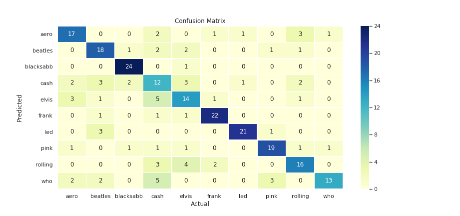
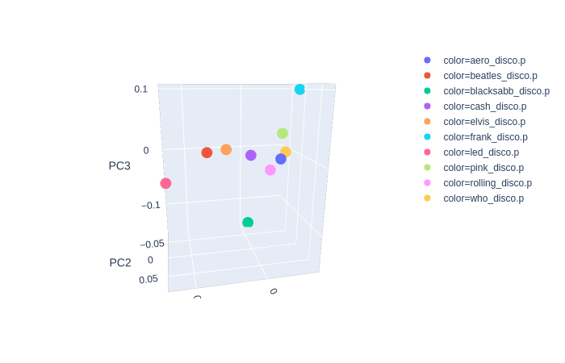

# Lyrics_Classifier
Do you really know your favorite artist? if i gave you one lyric, would you recognize it as his? that is a really tricky question, what would be an artist's blue print? 
That is the purpose of these project, create a machine that could recognize lyrics from different artists with an high accuracy. 
As we want good performance, we gave it a really difficult task: label lyrics from 10 of the greatest rock n roll contemporaneous bands (Aerosmith, Beatles, Black Sabbath, Johnny Cash, Elvis Presley, Frank Zappa, Led Zeppelin, Pink Floyd, Rollins Stones and The Who).

## Gathering Data
On creating_artists_files.ipynb you can see that we used www.lyrics.com to scrape 100 songs from each artist and create a pickle file for it, with song name url and lyric.

## Cleaning 
On the first part of the pipelines.ipynb notebook the artist.p files are unified, stop words are removed and words are transformed to their base form (lemmatization).

## Training and Testing
On the second part of the pipelines.ipynb notebook the sklearn.pipeline is used. That makes everything much faster and easier. 
Out of the 3 experimented models one that best performed was the Multinomial Naive Bayes with a 70% accuracy.

## Principal Component Analysis
To have a better understanding of the data you can see on the dimensionality_reduction_plots.ipynb notebook a couple 2D and 3D plots.
The most intersting one is the 3 components average plot, where you can see Zappa, Led and Sabbath , my favourites, oustand the most

